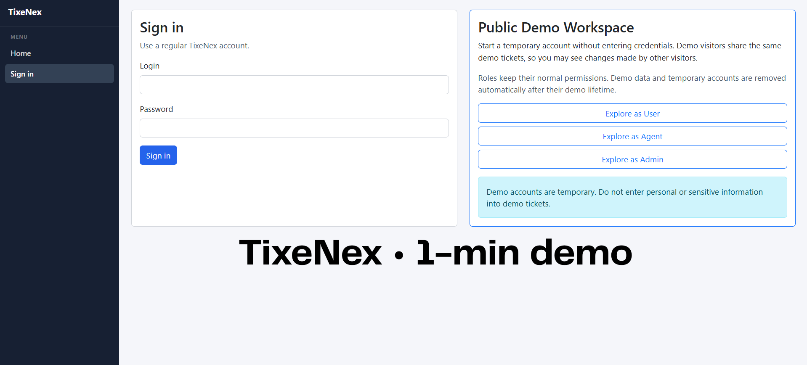
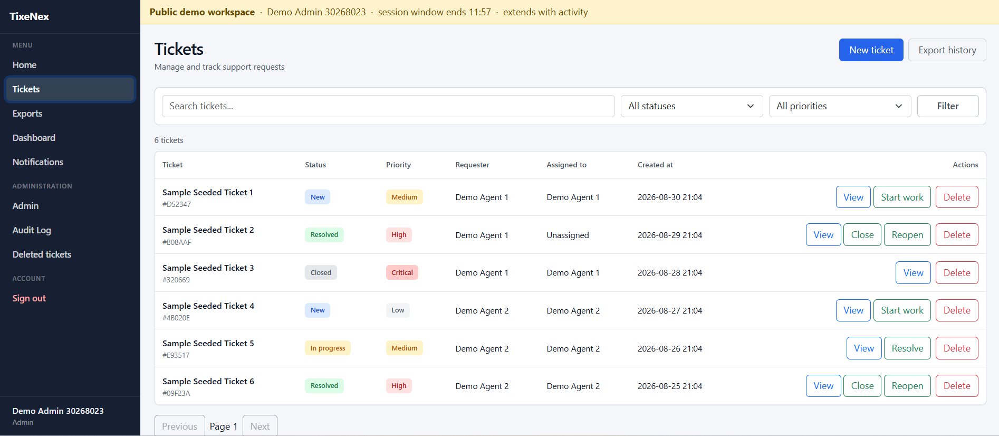
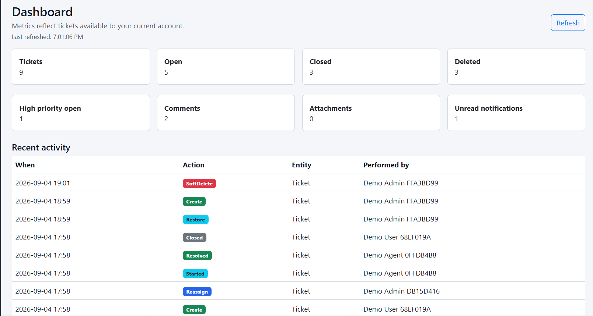
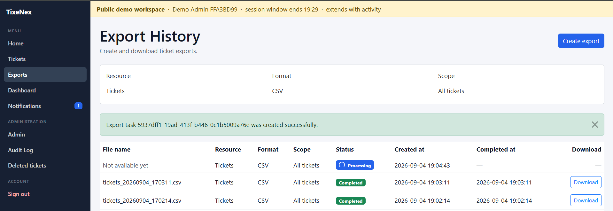
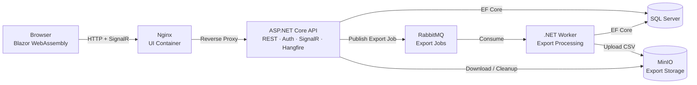

# TixeNex
**Production-style help desk and ticket management system built with ASP.NET Core and Blazor WebAssembly.**

[](https://github.com/oneboi42/TixeNex/actions/workflows/build.yml)


## 📖 Overview

**TixeNex** is a full-stack help desk system designed around role-based ticket workflows, resource isolation, and asynchronous processing.

The application models three main roles — **User**, **Agent**, and **Admin** — with ticket visibility and operations determined by both role and the user's relationship to each ticket. Tickets move through a controlled support workflow with automatic assignment, comments, attachments, notifications, and administrative operations.

A central architectural feature is the asynchronous export pipeline: export jobs are processed independently from the original API request by a separate background worker, while real-time updates keep connected clients synchronized.

The project emphasizes:

- Role- and relationship-based authorization
- Automated ticket assignment and controlled status workflows
- Asynchronous export processing outside the API request lifecycle
- Notifications and real-time ticket updates
- Background maintenance and demo-data lifecycle management
- Containerized deployment and automated testing

---

## 🌐 Live Demo

**[Open TixeNex Demo](https://tixenex.com/login)**

The public demo requires no registration or credentials. Choose a role to start a temporary demo session and explore the application with standard authorization and ticket-visibility rules enabled.

> **Tip:** Open User, Agent, and Admin sessions in separate tabs to move through the complete ticket workflow more easily.

---
### 🎬 Demo Preview

[](https://youtu.be/6YWmawzM67c)

**50-second walkthrough:** ticket workflow, role-based access, assignment, notifications, and exports.
#### Screenshots

##### Ticket Management


##### Dashboard Overview


##### Asynchronous Export Processing


---

### 🚀 Recommended Demo Flow

1. **User** — create a ticket and see it automatically assigned to an available agent.
2. **Admin** — inspect the ticket and optionally reassign it to your Demo Agent.
3. **Agent** — move the ticket through **New → In Progress → Resolved**.
4. **User** — close the resolved ticket or reopen it for further work.
5. **Export** — request a CSV export and follow its asynchronous processing through to download.
6. Explore comments, attachments, notifications, real-time ticket updates, and other role-specific functionality.

---
### 👥 Demo Roles

| Role | What you can explore |
| --- | --- |
| **User** | Create and track tickets, then close or reopen resolved requests |
| **Agent** | Work with assigned tickets and manage their status |
| **Admin** | Manage ticket assignments and broader administrative operations |

Each role selection creates a separate temporary demo account.

---

### 🧪 Demo Workspace Behavior

- Demo sessions last **30 minutes** and can be extended up to **1 hour 30 minutes**.
- Temporary demo data is automatically cleaned up after the session lifetime.
- The workspace includes predefined sample tickets, so the application can be explored immediately.
- Sample tickets can be modified and are automatically restored every **24 hours**.
- Two predefined agents are available for automatic workload-based ticket assignment.
- Admins can reassign tickets to other agents, including temporary Demo Agent accounts.

---

## Architecture & Tech Stack

TixeNex is a multi-project .NET application deployed as a Docker Compose multi-container system. The API handles application logic and authorization, while asynchronous export processing runs independently in a dedicated Worker.

### Tech Stack

| Layer | Technology |
| --- | --- |
| Frontend | Blazor WebAssembly, Razor, CSS |
| Backend | C#, ASP.NET Core Web API |
| Web Server / Reverse Proxy | Nginx |
| Authentication | ASP.NET Core Identity, JWT, Refresh Tokens |
| Database | SQL Server |
| ORM | Entity Framework Core |
| Messaging | RabbitMQ |
| Background Processing | .NET Worker |
| Scheduled Jobs | Hangfire |
| Real-Time Communication | SignalR |
| Object Storage | MinIO |
| Deployment | Docker Compose |

### Architecture



The Blazor WebAssembly client communicates with the ASP.NET Core API through Nginx using HTTP and SignalR. Both the API and export Worker access SQL Server directly. Export jobs are dispatched through RabbitMQ, processed by the Worker, and stored in MinIO.

Hangfire runs inside the API for scheduled and background application jobs. Ticket attachments are handled separately through the `IFileStorage` abstraction, while `TixeNex.Shared` provides shared DTOs and contracts between application projects.

---

## Key Features

### Ticket Management

* Create, view, update, assign, and reassign support tickets.
* Ticket workflow: **New → In Progress → Resolved → Closed**, with support for reopening resolved tickets.
* Automatic agent assignment based on current workload.
* Comments, attachments, priorities, filtering, search, and pagination.
* Role- and relationship-based ticket visibility for **User**, **Agent**, and **Admin**.
* Server-side authorization for protected operations.
* Admin Bin for soft-deleted tickets with restore support and Audit Log tracking.

### Authentication & Authorization

* ASP.NET Core Identity for users, roles, credentials, and password hashing.
* JWT Bearer authentication with refresh-token based session renewal.
* Session renewal and token revocation.
* Role-based and resource-level authorization.
* Users can access only tickets and related resources within their permitted scope.

### Asynchronous Exports

Ticket exports are processed outside the HTTP request lifecycle using a dedicated background-processing pipeline:

**API → RabbitMQ → TixeNex.Worker → MinIO**

* Persistent export jobs with tracked processing states.
* CSV ticket exports.
* Authorization-aware export scopes for each role.
* RabbitMQ-based processing with retry/requeue handling.
* Export files stored in MinIO object storage.
* Protected download through the API.

### Notifications & Real-Time Updates

* Notifications are generated for ticket creation, assignment and reassignment, status changes, comments, attachments, and soft deletion.
* Notifications are persisted, scoped to relevant recipients, and maintain read/unread state.
* SignalR pushes live ticket updates from the API to connected UI clients.

---

## Project Evolution & Contributions

TixeNex builds on a guided learning project that provided the initial solution architecture and core help-desk functionality. I significantly extended it with new infrastructure, authorization rules, asynchronous processing, deployment tooling, testing, and a public demo environment.

### Key Contributions

* **Asynchronous exports** — designed and implemented the export pipeline using RabbitMQ, a dedicated .NET Worker, and MinIO for background CSV generation and storage.
* **Authorization & isolation** — refactored ticket access into a centralized visibility and permission model based on role and the user's relationship to each ticket, then applied it across ticket operations, exports, and notifications.
* **Ticket workflow automation** — implemented workload-based automatic assignment and expanded the assignment/reassignment workflow.
* **Notifications & real-time updates** — redesigned notification rules and implemented SignalR-based live ticket updates.
* **Public demo environment** — built temporary role-based sessions, demo isolation, automated cleanup, shared demo workflows, and automatic restoration of sample data.
* **Deployment & CI** — created the Docker Compose deployment setup and added GitHub Actions workflows.
* **Testing & security** — substantially expanded API, UI, and Worker test coverage and performed additional security hardening and verification in an isolated disposable VM.
* **UI & dashboard** — redesigned parts of the application interface and extended dashboard functionality.


---
## Testing

The solution includes automated tests for the **API, UI, and Worker**, covering core workflows, authorization boundaries, export processing, and other application behavior.

Run the full test suite with:

```bash
dotnet test
```

Tests are also executed automatically through **GitHub Actions**.

---

## Running Locally

TixeNex can be started locally through Docker Compose.

**Requirements:** Docker and Docker Compose.

Clone the repository:

```bash
git clone https://github.com/oneboi42/TixeNex
cd TixeNex
```

Create the local environment configuration:

```bash
cp .env.example .env
```

Configure the required values in `.env`, then build and start the application:

```bash
docker compose up -d --build
```

Docker Compose starts the UI, API, Worker, SQL Server, RabbitMQ, and MinIO services together with their required networking, health checks, startup dependencies, and persistent volumes.

---

## Roadmap & Current Limitations


TixeNex is a portfolio project built with production-oriented architecture and deployment practices. The current version focuses on a complete help desk workflow and the main architectural features demonstrated throughout the project.

Planned improvements include:

* expanding the Admin panel with additional user, ticket, and system-management capabilities;
* adding stronger observability, including structured logging, application metrics, distributed tracing, and improved monitoring of the API, Worker, and supporting services;
* moving ticket attachments from local filesystem storage to object storage;
* extending exports beyond CSV, with additional formats and filtering options;
* adding additional notification channels alongside the current in-app notifications;
* improving operational visibility for asynchronous work, including dedicated monitoring and history for failed, retried, and long-running export jobs.

The main current limitations are local attachment storage, CSV-only exports, limited operational observability, and the limited scope of some administrative functionality.
